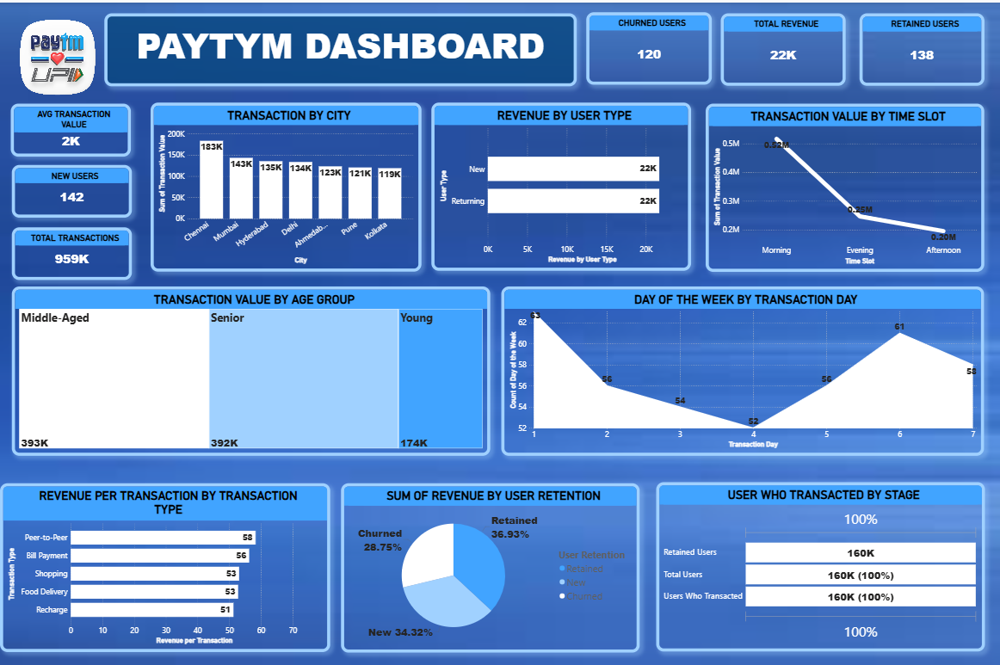

# Paytm Transaction Analysis Dashboard

## 📊 Project Overview

An interactive **Power BI dashboard** designed to analyze Paytm transaction data and understand transaction performance, revenue, user behavior, customer retention, demographics, and transaction patterns.

The dashboard transforms transaction data into interactive visualizations and key performance indicators (KPIs) to provide a clear overview of user and transaction activity.

---

## 🎯 Project Objectives

The main objectives of this project are to:

- Analyze overall transaction performance
- Identify cities with higher transaction activity
- Compare revenue generated by different user types
- Analyze transaction values across different time slots
- Understand transaction behavior across different age groups
- Analyze transaction activity by day of the week
- Compare revenue across different transaction types
- Analyze customer retention and churn
- Understand different stages of user transaction activity

---

## 🛠️ Tools & Technologies

- **Power BI**
- **Microsoft Excel**
- **Power Query**
- **DAX**
- **Data Analysis**
- **Data Visualization**
- **Business Intelligence**

---

## 📌 Key Performance Indicators

The dashboard provides several important KPIs, including:

- **Churned Users:** 120
- **Total Revenue:** 22K
- **Retained Users:** 138
- **Average Transaction Value:** 2K
- **New Users:** 142
- **Total Transactions:** 959K

---

## 📈 Dashboard Analysis

### 1. Transaction by City

Analyzes transaction value across different cities.

The dashboard compares cities including:

- Chennai
- Mumbai
- Hyderabad
- Delhi
- Ahmedabad
- Pune
- Kolkata

Among the displayed cities, **Chennai records the highest transaction value at 183K**.

---

### 2. Revenue by User Type

Compares revenue generated by different user categories:

- New Users
- Returning Users

The dashboard shows approximately **22K revenue for both New and Returning users**.

---

### 3. Transaction Value by Time Slot

Analyzes transaction value across different time periods:

- Morning
- Evening
- Afternoon

The displayed analysis shows the highest transaction value during the **Morning**, followed by Evening and Afternoon.

---

### 4. Transaction Value by Age Group

Analyzes transaction value across three age groups:

- Young
- Middle-Aged
- Senior

The displayed values are:

- **Middle-Aged:** 393K
- **Senior:** 392K
- **Young:** 174K

Middle-aged users account for the highest transaction value among the displayed age groups.

---

### 5. Day of the Week Analysis

Analyzes transaction activity across the seven days of the week.

The dashboard shows variations in transaction activity across different transaction days, with the highest displayed value occurring on **Day 1**.

---

### 6. Revenue per Transaction Type

Compares revenue per transaction across different transaction categories:

- Peer-to-Peer
- Bill Payment
- Shopping
- Food Delivery
- Recharge

The displayed analysis shows **Peer-to-Peer** as the highest revenue-per-transaction category.

---

### 7. User Retention Analysis

The dashboard analyzes the distribution of users based on retention status:

- **Retained:** 36.93%
- **New:** 34.32%
- **Churned:** 28.75%

Retained users represent the largest segment in the displayed retention analysis.

---

### 8. User Transaction Stage

The dashboard provides an overview of users at different transaction stages, including:

- Total Users
- Users Who Transacted
- Retained Users

The displayed dashboard shows **160K total users** and **160K users who transacted**.

---

## 🔍 Key Insights

Based on the dashboard analysis:

- Chennai has the highest transaction value among the displayed cities.
- Mumbai and Hyderabad are also among the higher-performing cities.
- New and returning users contribute similar revenue in the displayed analysis.
- Morning transactions have the highest transaction value among the displayed time slots.
- Middle-aged users account for the highest transaction value among the displayed age groups.
- Peer-to-Peer transactions have the highest revenue per transaction.
- Retained users represent the largest segment in the displayed user retention analysis.
- Transaction activity varies across different days of the week.

---

## 📷 Dashboard Preview

---

## 📂 Project Files

| File | Description |
|------|-------------|
| `paytm_dashboard.pbix` | Power BI dashboard file |
| `paytm.xlsx` | Dataset used for analysis |
| `dashboard_preview.png` | Dashboard preview image |
| `README.md` | Project documentation |

---

##  How to Use

1. Download `paytm_dashboard.pbix` from this repository.
2. Open the file using **Microsoft Power BI Desktop**.
3. If required, reconnect the dataset or refresh the data.
4. Interact with the dashboard visuals and filters.
5. Explore transaction, revenue, user, demographic, and retention insights.

---

##  Skills Demonstrated

- Data Cleaning
- Data Transformation
- Data Analysis
- Data Visualization
- Dashboard Development
- KPI Development
- Business Intelligence
- Power BI
- Power Query
- DAX
- Analytical Thinking

---

## Project Purpose

This project was created as part of my **Data Analytics and Business Intelligence portfolio** to demonstrate practical skills in data analysis, interactive dashboard development, data visualization, and extracting meaningful insights from transactional data.

---

##  Author

**Simrat Kaur**

B.Tech Computer Science & Engineering  
Specialization: Artificial Intelligence & Machine Learning
